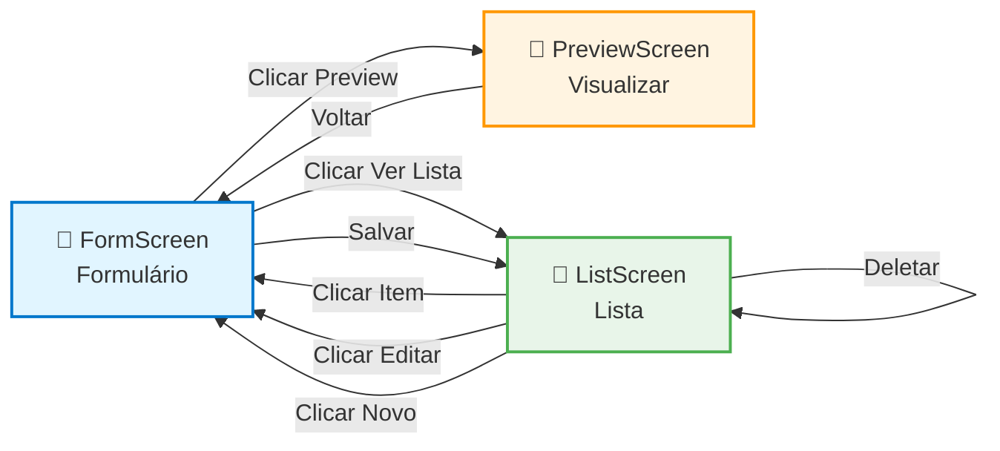

# Atividade Prática — PerfilApp

## Objetivo

Criar um projeto separado que demonstre navegação e passagem de dados entre telas. O aluno deve implementar o app localmente em um novo repositório e publicá-lo no GitHub.

## Requisitos mínimos

- Criar um novo repositório local (nome sugerido: `PerfilApp`) e publicar no GitHub.
- O app deve ter exatamente 2 telas: `FormScreen` e `PreviewScreen`.
- Implementar navegação com `@react-navigation/native` e `@react-navigation/native-stack`.
- `FormScreen` deve conter 3 campos: `nome`, `email`, `bio` (TextInput) e um botão `Preview`.
- Ao clicar em `Preview`, navegar para `PreviewScreen` passando os dados via `navigation.navigate('Preview', { nome, email, bio })`.
- `PreviewScreen` deve receber os dados via `route.params` e exibir em um cartão estilizado, além de ter um botão que volta para `FormScreen` (ou para `Home`).
- Implementar validação mínima: `nome` e `email` obrigatórios; email com regex simples; impedir navegação se inválido e mostrar mensagem de erro inline.
- Implementar tema: aplicar um tema (cores, espaçamento, tipografia)
- Implementar botão `Salvar localmente` que persiste os dados em `AsyncStorage`.

## Sugestão de comandos iniciais

Use o template `defaultexpo-template-blank-typescript` e crie o projeto com o comando abaixo:

```bash
npx create-expo-app@latest PerfilApp --template expo-template-blank-typescript
```

## Estrutura sugerida

- `App.tsx` — configura o `NavigationContainer` e o `Stack.Navigator` com as rotas `Form` e `Preview`.
- `src/screens/FormScreen.tsx` — formulário, validação e `navigation.navigate('Preview', { ... })`.
- `src/screens/PreviewScreen.tsx` — exibe `route.params` em um cartão.

## Entrega no GitHub

- Repositório público com código funcional.
- `README.md` curto explicando: como rodar, decisões de validação e instruções de uso.
- Commits claros por etapa (criando projeto, telas, passagem de dados, validação).

## Dicas

- Use `route.params?.campo` para acessar parâmetros com segurança.
- Valide email com uma expressão simples: `/^\S+@\S+\.\S+$/`.
- Para formulários longos, use `KeyboardAvoidingView` ou `react-native-keyboard-aware-scroll-view`.
- Teste no dispositivo com Expo Go.

## Tarefa extra:

- Objetivo: aplicar um tema (cores, espaçamento, tipografia) ao `PerfilApp`.
- Passos sugeridos:
	- Crie `src/styles/theme.ts` em `PerfilApp` com cores, espaçamentos e tamanhos de fonte (padrões semelhantes aos do `PrimeiroApp`).
	- Atualize `FormScreen` e `PreviewScreen` para usar o tema via import (`import theme from '../styles/theme'`) e `StyleSheet.create`.
	- Garanta que o `PreviewScreen` apresente um cartão com fundo levemente acinzentado, borda arredondada e espaçamento interno.
	- Use cores primárias para títulos e cores de texto escuras para conteúdo.

## Tarefa extra 2: CRUD Completo — Persistência de dados

### Objetivo

Implementar um **CRUD completo** (Create, Read, Update, Delete) para exemplificar o ciclo completo de gerenciamento de dados locais com `AsyncStorage`.

### Requisitos

1. **Criar (Create)**: Botão `Salvar localmente` que persiste o perfil com um ID único em `AsyncStorage`.
2. **Ler (Read)**: Listar todos os perfis salvos em uma nova tela `ListScreen`.
3. **Atualizar (Update)**: Permitir editar um perfil selecionado retornando à `FormScreen` com os dados preenchidos.
4. **Deletar (Delete)**: Botão de exclusão que remove um perfil da lista.

### Fluxo de Navegação



### Passos sugeridos

#### 1. Instalar AsyncStorage

```bash
expo install @react-native-async-storage/async-storage
```

#### 2. Criar `src/services/storage.ts` (helper para AsyncStorage)

```ts
import AsyncStorage from '@react-native-async-storage/async-storage';

export async function saveItem(key: string, value: any) {
  try {
    const s = JSON.stringify(value);
    await AsyncStorage.setItem(key, s);
  } catch (e) {
    console.warn('saveItem error', e);
    throw e;
  }
}

export async function loadItem<T = any>(key: string): Promise<T | null> {
  try {
    const s = await AsyncStorage.getItem(key);
    return s ? (JSON.parse(s) as T) : null;
  } catch (e) {
    console.warn('loadItem error', e);
    return null;
  }
}

export async function removeItem(key: string) {
  try {
    await AsyncStorage.removeItem(key);
  } catch (e) {
    console.warn('removeItem error', e);
  }
}
```

#### 3. Modificar `FormScreen` para salvar e editar perfis

```tsx
import React, { useEffect, useState } from 'react';
import { View, TextInput, Button, StyleSheet, Alert } from 'react-native';
import { NativeStackScreenProps } from '@react-navigation/native-stack';
import { saveItem, loadItem } from '../services/storage';

type Props = NativeStackScreenProps<RootStackParamList, 'Form'>;

export default function FormScreen({ navigation, route }: Props) {
  const [nome, setNome] = useState('');
  const [email, setEmail] = useState('');
  const [bio, setBio] = useState('');
  const [editingId, setEditingId] = useState<string | null>(null);

  useEffect(() => {
    // Se navegou com um ID para editar, carregar os dados
    if (route.params?.id) {
      (async () => {
        const perfis = (await loadItem<any[]>('perfis')) || [];
        const perfil = perfis.find(p => p.id === route.params?.id);
        if (perfil) {
          setNome(perfil.nome);
          setEmail(perfil.email);
          setBio(perfil.bio);
          setEditingId(perfil.id);
        }
      })();
    }
  }, [route.params?.id]);

  async function handleSave() {
    if (!nome.trim() || !email.trim()) {
      Alert.alert('Erro', 'Nome e email são obrigatórios');
      return;
    }

    const perfis = (await loadItem<any[]>('perfis')) || [];
    
    if (editingId) {
      // Atualizar perfil existente
      const atualizado = perfis.map(p =>
        p.id === editingId
          ? { ...p, nome, email, bio }
          : p
      );
      await saveItem('perfis', atualizado);
      Alert.alert('Sucesso', 'Perfil atualizado');
    } else {
      // Criar novo perfil
      const novoPerfil = {
        id: String(Date.now()),
        nome,
        email,
        bio
      };
      await saveItem('perfis', [...perfis, novoPerfil]);
      Alert.alert('Sucesso', 'Perfil salvo com sucesso');
    }

    // Limpar form e navegar para lista
    setNome('');
    setEmail('');
    setBio('');
    setEditingId(null);
    navigation.navigate('List');
  }

  return (
    <View style={styles.container}>
      <TextInput
        value={nome}
        onChangeText={setNome}
        placeholder="Nome"
        style={styles.input}
      />
      <TextInput
        value={email}
        onChangeText={setEmail}
        placeholder="Email"
        style={styles.input}
      />
      <TextInput
        value={bio}
        onChangeText={setBio}
        placeholder="Bio"
        style={styles.input}
        multiline
      />
      <Button
        title={editingId ? 'Atualizar' : 'Salvar'}
        onPress={handleSave}
      />
      <Button
        title="Ver Lista"
        onPress={() => navigation.navigate('List')}
      />
    </View>
  );
}

const styles = StyleSheet.create({
  container: { flex: 1, padding: 16 },
  input: { borderWidth: 1, borderColor: '#ccc', padding: 8, marginBottom: 12, borderRadius: 4 },
});
```

#### 4. Criar `src/screens/ListScreen.tsx` (listar, editar e deletar)

```tsx
import React, { useFocusEffect, useState } from 'react';
import { View, Text, FlatList, TouchableOpacity, Button, StyleSheet, Alert } from 'react-native';
import { NativeStackScreenProps } from '@react-navigation/native-stack';
import { loadItem, saveItem } from '../services/storage';

type Props = NativeStackScreenProps<RootStackParamList, 'List'>;

export default function ListScreen({ navigation }: Props) {
  const [perfis, setPerfis] = useState<any[]>([]);

  // useCallback Hook: recarrega dados quando a tela fica em foco
  useFocusEffect(
    React.useCallback(() => {
      (async () => {
        const lista = (await loadItem<any[]>('perfis')) || [];
        setPerfis(lista);
      })();
    }, [])
  );

  async function handleDelete(id: string) {
    Alert.alert('Confirmar', 'Deseja deletar este perfil?', [
      { text: 'Cancelar', style: 'cancel' },
      {
        text: 'Deletar',
        style: 'destructive',
        onPress: async () => {
          const filtrado = perfis.filter(p => p.id !== id);
          await saveItem('perfis', filtrado);
          setPerfis(filtrado);
          Alert.alert('Sucesso', 'Perfil deletado');
        },
      },
    ]);
  }

  return (
    <View style={styles.container}>
      <Text style={styles.title}>Lista de Perfis</Text>
      {perfis.length === 0 ? (
        <Text style={styles.empty}>Nenhum perfil salvo</Text>
      ) : (
        <FlatList
          data={perfis}
          keyExtractor={p => p.id}
          renderItem={({ item }) => (
            <View style={styles.card}>
              <TouchableOpacity
                onPress={() => navigation.navigate('Form', { id: item.id })}
              >
                <Text style={styles.nome}>{item.nome}</Text>
                <Text style={styles.email}>{item.email}</Text>
                <Text style={styles.bio}>{item.bio}</Text>
              </TouchableOpacity>
              <View style={styles.buttons}>
                <Button
                  title="Editar"
                  onPress={() => navigation.navigate('Form', { id: item.id })}
                />
                <Button
                  title="Deletar"
                  color="red"
                  onPress={() => handleDelete(item.id)}
                />
              </View>
            </View>
          )}
        />
      )}
      <Button title="Novo Perfil" onPress={() => navigation.navigate('Form')} />
    </View>
  );
}

const styles = StyleSheet.create({
  container: { flex: 1, padding: 16 },
  title: { fontSize: 20, fontWeight: 'bold', marginBottom: 16 },
  empty: { textAlign: 'center', marginTop: 20, color: '#999' },
  card: {
    borderWidth: 1,
    borderColor: '#ddd',
    borderRadius: 8,
    padding: 12,
    marginBottom: 12,
    backgroundColor: '#f9f9f9',
  },
  nome: { fontSize: 16, fontWeight: 'bold', marginBottom: 4 },
  email: { fontSize: 14, color: '#666', marginBottom: 4 },
  bio: { fontSize: 12, color: '#999', marginBottom: 8 },
  buttons: { flexDirection: 'row', gap: 8 },
});
```

#### 5. Atualizar `App.tsx` com a nova rota

```tsx
// MODIFICAR: adicionar rota para ListScreen
import { NavigationContainer } from '@react-navigation/native';
import { createNativeStackNavigator } from '@react-navigation/native-stack';
import FormScreen from './src/screens/FormScreen';
import ListScreen from './src/screens/ListScreen';
import PreviewScreen from './src/screens/PreviewScreen';

const Stack = createNativeStackNavigator();

export default function App() {
  return (
    <NavigationContainer>
      <Stack.Navigator>
        <Stack.Screen name="Form" component={FormScreen} options={{ title: 'Novo Perfil' }} />
        <Stack.Screen name="List" component={ListScreen} options={{ title: 'Meus Perfis' }} />
        <Stack.Screen name="Preview" component={PreviewScreen} options={{ title: 'Preview' }} />
      </Stack.Navigator>
    </NavigationContainer>
  );
}
```

### Checklist de implementação

- [ ] Instalar `@react-native-async-storage/async-storage`
- [ ] Criar `src/services/storage.ts` com funções `saveItem`, `loadItem`, `removeItem`
- [ ] Modificar `FormScreen` para suportar criação e edição (usando `route.params?.id`)
- [ ] Criar `ListScreen` com lista de perfis salvos usando `FlatList`
- [ ] Implementar exclusão com confirmação via `Alert.alert`
- [ ] Implementar edição: navegar para `FormScreen` com os dados do perfil
- [ ] Usar `useFocusEffect` para recarregar a lista quando a tela fica em foco
- [ ] Adicionar a rota `List` no `App.tsx`
- [ ] Testar fluxo completo: criar → listar → editar → deletar

### Dicas importantes

- Use `useFocusEffect` do `@react-navigation/native` para recarregar dados quando a tela retorna ao foco.
- Sempre envolva operações de storage em `try/catch` e trate erros.
- Use `Alert.alert()` para confirmações de deletar ou erros de validação.
- Gere IDs únicos com `String(Date.now())` ou `crypto.randomUUID()` (Expo suporta).
- Teste com `expo start` e reinicialize o app para confirmar que os dados persistem.
